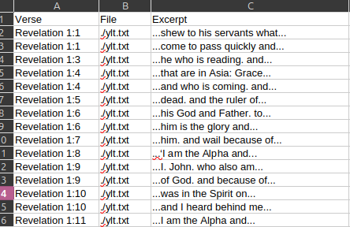
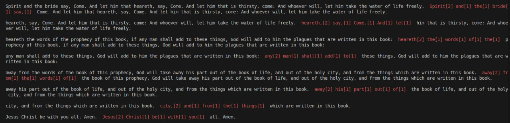

A script that checks texts formatted like OpenBible's corpus against presumed syllable counts for verses from 
SMT III: Nocturne's soundtrack, with the potential eventual goal of replicating the lines with Mac's old
Albert TTS voice and compare.

This is a step in a heuristic analysis of the two media in order to hopefully recover the original lyrics used
to create the song, for potential future tts instrumentation and vocal covers.

# Setup
A setup script has been included in [setup.sh](setup.sh).

This will download the books and clone my fork of the syllabifier repository into the `syllabifier` subdirectory.

# Usage
After running the setup script, you can run with default settings using `python .`

If desired, you can edit the syllable groups checked against by modifying the `verses` (line 5) list in 
[__main__.py](__main__.py), change the number of words the script will fuzz between syllable matches by 
changing the `permissible_skips` kwarg in the check call (line 21), or generally mess around.

This isn't well documented because I made it over lunch in a day and don't want to mess with it too much.

# Output

This script will output one CSV per verse with a line per possible match.

In addition, console output will be highlighted with matching excerpts.

